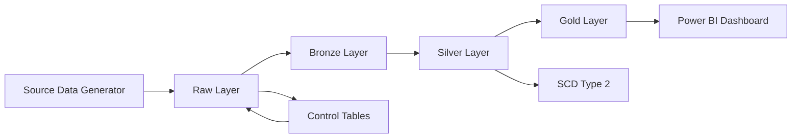

# 🛒 Omni Retail Data Platform

A production-style **end-to-end data engineering project** that simulates a retail analytics platform using a **medallion architecture (Raw → Bronze → Silver → Gold)** with **SCD Type 2**, data quality checks, and BI integration.

---

## 🚀 Overview

This project demonstrates how to design and implement a **real-world data pipeline** that handles:

* Incremental batch ingestion
* Idempotent processing (no duplicate loads)
* Data cleaning and standardization
* Business rule validation
* Historical tracking (Slowly Changing Dimensions - Type 2)
* Analytics-ready data modeling
* Real-time dashboards using Power BI (DirectQuery)

---

## 🏗️ Architecture

### High-Level Diagram


### Data Flow



---

## 🧱 Data Architecture

### 🔹 Raw Layer (Landing Zone)

* Stores source data without transformation
* Adds ingestion metadata:

  * `batch_id`
  * `source_file_name`
  * `ingested_at`
  * `record_hash`
* Tracks processed files using checksum-based control tables
* Ensures **idempotent ingestion**

---

### 🔹 Bronze Layer (Standardization)

* Cleans raw data (trim, normalize text)
* Handles duplicates
* Keeps latest records for mutable entities
* Prepares data for business validation

---

### 🔹 Silver Layer (Business Logic)

* Applies validation rules:

  * valid customers, stores, products
  * valid order/payment statuses
* Removes invalid and orphan records
* Builds trusted datasets:

  * `orders_clean`
  * `payments_clean`
  * `order_items_clean`
  * `refunds_clean`
* Implements **SCD Type 2**:

  * `dim_customer_history`
  * `dim_product_history`

---

### 🔹 Gold Layer (Analytics)

* Star schema design

#### Fact Tables

* `fact_sales`
* `fact_sales_items`
* `fact_refunds`

#### Dimension Tables

* `dim_customer`
* `dim_product`
* `dim_store`

#### Aggregated Mart

* `mart_daily_sales`

---

## 📊 Dashboard Preview

### Executive Overview


Provides KPIs such as revenue, orders, AOV, and refund trends.

---

### Sales Analysis


Breakdown of sales by store, channel, and time.

---

### Product Analysis


Product-level insights enabled by `fact_sales_items`.

---

## 🧠 Key Features

* ✅ Idempotent ingestion using file checksum tracking
* ✅ Batch-based processing with control tables
* ✅ Medallion architecture (Raw → Bronze → Silver → Gold)
* ✅ Robust data cleaning and validation
* ✅ SCD Type 2 for historical tracking
* ✅ Analytics-ready star schema
* ✅ Power BI integration (DirectQuery)

---

## 🛠️ Tech Stack

* **Python** (pandas, SQLAlchemy)
* **PostgreSQL**
* **Power BI (DirectQuery)**
* **Faker** (data generation)
* **uv** (package & environment management)

---

## 📂 Project Structure

```
omni-retail-de/
│
├── assets/                 # Images (architecture, dashboards)
│
├── data/
│   └── source_batches/     # Generated batch data
│
├── sql/
│   └── ddl/                # Table creation scripts
│
├── src/
│   ├── generator/          # Data generation scripts
│   ├── ingestion/          # Raw ingestion logic
│   ├── transform/          # Bronze, Silver, Gold transformations
│   ├── quality/            # Data cleaning & validation
│   └── utils/              # DB, logger, configs
│
├── .env
├── pyproject.toml
└── README.md
```

---

## ⚙️ How to Run

### 1. Install dependencies

```bash
uv sync
```

### 2. Generate data

```bash
uv run python -m src.generator.master_data_generator
uv run python -m src.generator.transaction_data_generator
```

### 3. Run ingestion

```bash
uv run python -m src.ingestion.ingest_raw_batch
```

### 4. Run transformations

```bash
uv run python -m src.transform.bronze
uv run python -m src.transform.silver
uv run python -m src.transform.gold
```

---

## 📈 Example Use Cases

* Daily sales reporting
* Store performance tracking
* Customer segmentation
* Product performance analysis
* Refund and anomaly monitoring

---

## 🧪 Data Scenarios Simulated

* Duplicate records
* Late-arriving data
* Slowly changing dimensions
* Invalid relationships (filtered in silver layer)
* Missing / inconsistent values

---

## 🎯 Key Learnings

* Designing scalable data pipelines
* Handling real-world messy data
* Implementing SCD Type 2
* Building analytics-ready data models
* Integrating pipelines with BI tools

---

## 🔮 Future Improvements

* Incremental processing (no full refresh)
* Airflow orchestration
* Data quality monitoring dashboards
* ML-based anomaly detection
* Cloud deployment (GCP/AWS)

---

## 👨‍💻 Author

**Sameera**
Data Governance Analyst → Aspiring Data Engineer

---

## ⭐ Final Note

This project demonstrates a **complete data engineering lifecycle**, from ingestion to analytics, with a strong focus on **real-world data challenges and production-style design**.
